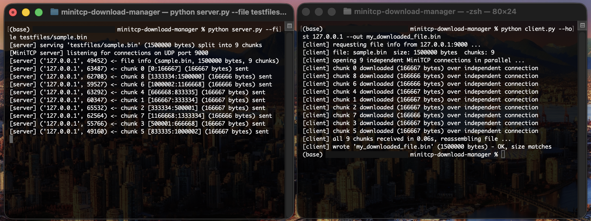

# 🌐 MiniTCP Download Manager


A two-part networking project featuring a custom, reliable transport protocol (**MiniTCP**) built entirely on top of UDP, and a **Download Manager** that utilizes this protocol to fetch files concurrently.

## 🚀 Overview

1. **MiniTCP Protocol:** A reliable, connection-oriented transport layer implemented over standard UDP sockets. It ensures data integrity, sequencing, and delivery guarantees across lossy networks.
2. **Download Manager:** A client/server application that splits a requested file into 9 distinct chunks. The client downloads all 9 chunks simultaneously over 9 independent MiniTCP connections, reassembling the file upon completion.

## ✨ Core Protocol Features

MiniTCP implements the fundamental mechanics of standard TCP:

- **Connection Management:** 3-way handshake (`SYN`, `SYN-ACK`, `ACK`) for connection setup and a symmetric 4-way close (`FIN`, `ACK`, `FIN`, `ACK`) for teardown.
- **Reliability & Sequencing:** 15-byte custom packet headers containing Sequence (SEQ) and Acknowledgement (ACK) numbers, alongside CRC32 checksums for data integrity.
- **Loss Detection & Recovery:** Implements Stop-and-Wait ARQ with timeout-based loss detection and automatic retransmission with backoff.
- **Concurrency:** Each file chunk connection operates on its own ephemeral UDP port via independent Python threads.

## 🏃 Run Guide

**Requirements:** Python 3.8+, standard library only — nothing to `pip install`.

**1. Start the server** (in one terminal). This serves the sample file, split into 9 chunks, on UDP port 9000, with verbose packet-level logging:

```bash
python3 server.py --file testfiles/sample.bin --port 9000 --chunks 9 -v
```

You should see it confirm the file/chunk setup and then sit listening for connections.

**2. Run the client** (in a second terminal), also verbose:

```bash
python3 client.py --host 127.0.0.1 --port 9000 --out downloaded.bin -v
```

This fetches file info, opens 9 parallel MiniTCP connections, downloads all 9 chunks concurrently, and reassembles them into `downloaded.bin`. With `-v` on, you'll see every SYN/ACK/DATA/FIN packet exchanged on both ends — useful for actually watching the handshake and retransmission logic work in real time.

**3. Verify the download is byte-for-byte correct:**

```bash
sha256sum testfiles/sample.bin downloaded.bin
```

Both hashes should match exactly.

**Example run:**



**Optional — test reliability under packet loss:** add `--loss 0.1` to either command (drops ~10% of outgoing packets) to watch MiniTCP's timeout/retransmission recover automatically:

```bash
python3 server.py --file testfiles/sample.bin --port 9000 --chunks 9 --loss 0.1 -v
python3 client.py --host 127.0.0.1 --port 9000 --out downloaded.bin --loss 0.1 -v
```

## 📂 Repository Structure

```text
├── client.py               # Download Manager client script
├── server.py                # Download Manager server script
├── minitcp/                 # The custom protocol package
│   ├── protocol.py          # Packet formatting, encoding, and checksums
│   └── connection.py        # Handshake, send/recv, retransmission logic
├── docs/                     # System architecture and protocol design PDFs
└── testfiles/                # Sample binary files for transfer testing
```
